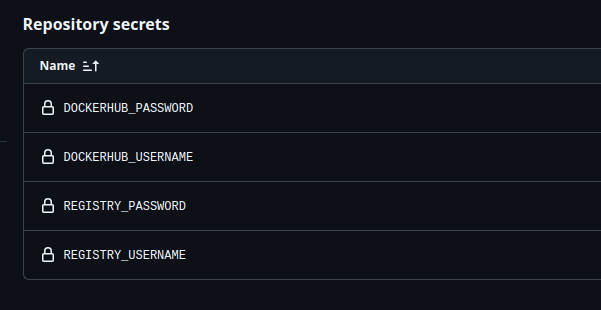
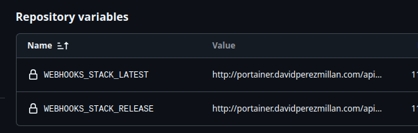

## MS_Black

En este proyecto se define la estructura de despligue continuo,utilizando github actions, dockerhub y portainer en el servidor.

## GIHUB ACTIONS
Se han creado dos acciones:
- **deploy_latest.yml**: Se encarga de construir la imagen de la aplicacion en desarrollo y subirla al repositorio de dockerhub.
- **deploy_release.yml**: Se encarga de construir la imagen de la aplicacion en produccion y subirla al repositorio de dockerhub.

 `En este caso se han definido en las acciones`

Existen una serie de secretos y variables que se definen en estos actions.

DOCKERHUB_PASSWORD
DOCKERHUB_USERNAME
REGISTRY_PASSWORD
REGISTRY_USERNAME

WEBHOOKS_STACK_LATEST
WEBHOOKS_STACK_RELEASE

## PORTAINER
Se ha desplegado un contenedor de portainer en el servidor, para poder gestionar los contenedores de una forma mas visual.

Tenemos que rellenar el template con estos datos para poder desplegar el contenedor.

[env](env)

